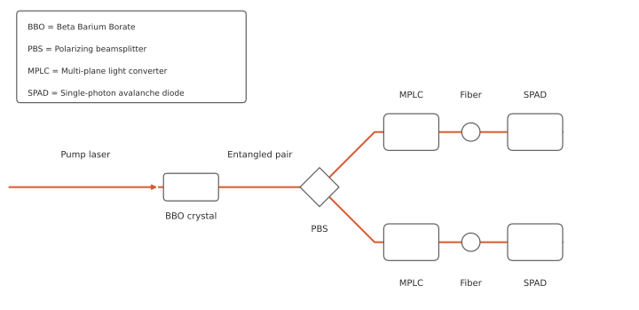
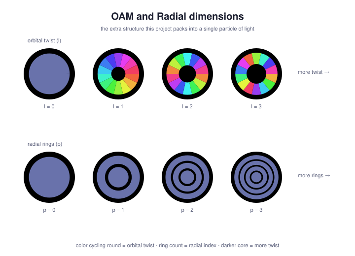
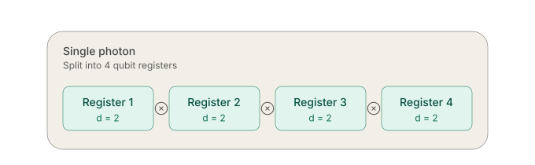
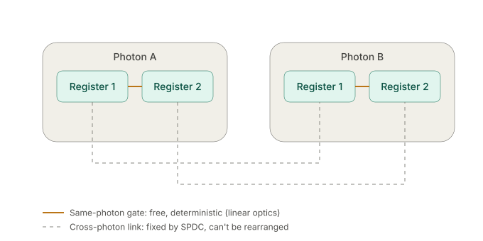
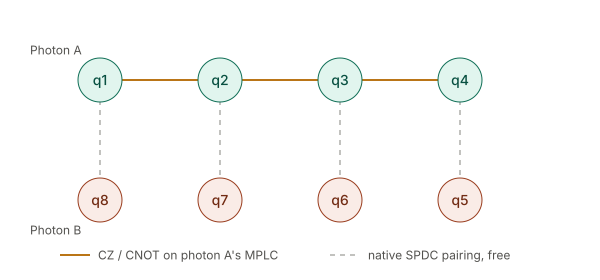
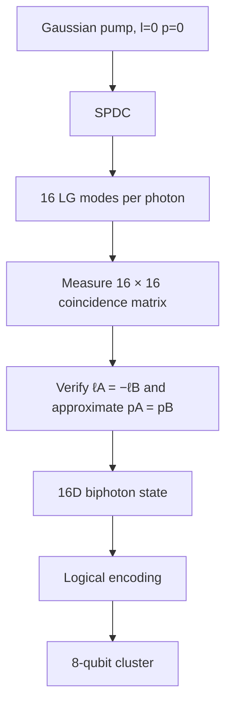
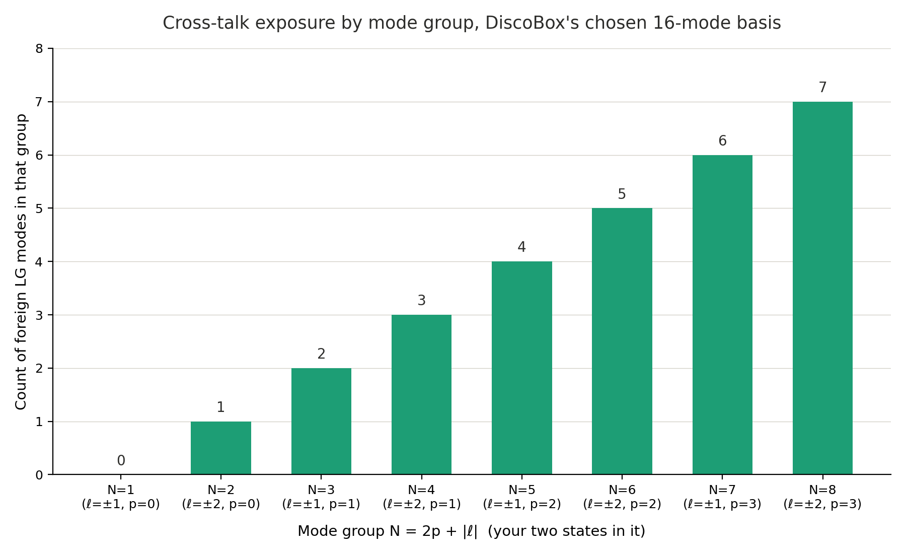

# DiscoBox

An open-source photonic quantum computing platform targeting an **8-qubit** cluster state (and beyond!)

$\small\text{Status: design phase, not yet built.}$

## The quick of it  

We start with a pure 405nm transverse pump wave where $\ell,p=0$.

Then send it into our Beta Barium Borate (BBO) non-linear crystal where one 405nm photon splits into two 810nm daughters.

Our entangled photons exit the crystal with orthogonal polarizations (from the type-II phase matching), which we exploit with a polarizing beam splitter (PBS) which splits the photons down seperate paths (and some index flipping tricks we will see later).

Each path gets a Multi-plane light converter (MPLC) setup, which is a Spatial Light Modulator (SLM) and a mirror angled to make several passes through it. Here is where our quantum gates get written (via Unitary transformations), and also set the measurement basis before we send it into the fiber. A single-mode fiber only efficiently couples the fundamental Gaussian mode, so the last hologram is calculated to "flatten" whichever mode we're currently projecting onto back down into that fundamental mode.

And finally, each path hits its own Single Photon Avalanche Diode (SPAD) detector. Our final 1-16 value per photon is determined by which of the 16 sequential hologram settings on that path's MPLC was active when the click registered, since our SPAD only registers a click - we're going the cheap route to start with we can upgrade this later.

  

None of this is original work I'm combining Forbes/He/Shen's dimension scaling and Lib/Bromberg's qudit partitioning, with the hopes that we can scale dimensions (and thus effective qubit size) relatively easily by simply swapping in better hardware. 

The architecture can be described roughly as:

$$
\boxed{
\text{4 OAM DOF}\times\text{4 radial DOF}
\rightarrow
16\text{ orthogonal modes}
\rightarrow
16\text{-dimensional Hilbert space}
\rightarrow
4\text{ logical qubits}
}
$$

## Let's make some dimensions

We're scaling our 405nm-laser-spdc-entangled-photons into high dimensions by twisting the orbital angular momentum (2 to the left and 2 to the right for **l=4 distinct values {-2,-1,1,2}**) and altering the radials (**p=4 distinct values {0,1,2,3}**)  for 16 usable dimensions (**l*p**)  in preparation for the next step which must be said with jazz hands: ***hyper-dimensional-encoding*** (the creators Lib & Bromberg call it "high-dimensional spatial encoding of cluster states")

## Hyper Dimensional Encoding

Take our 16d Hilbert space we just created and partition it into "registers" where dimension=2 (a traditional qubit) which we connect via tensor products. <u>**This is the part that gives us intra-photon gates without requiring photon on photon interaction.**</u>

Cross photon gates can't be rearranged after SPDC. The graph work is arranging the circuit so anything that needs to interact lands on registers within the same photon where it's free, instead of needing a cross-photon gate.

$\small\textit{Lib and Bromberg have already experimentally encoded four qubits in 16 spatial modes of a photon as part of an eight-qubit cluster state.
}$

Which gives us 4 logical qubits per photon. If you want to build a full GHZ state from registers 1,2&3 via an H and two CNOT gates you can totally do that. Brandt et al. demonstrated exactly this intra-photon gate experimentally, a two-qubit CNOT using the OAM and radial degrees of freedom on a single photon.

## The Math of it

$$
\begin{aligned}
\ell &\in \{-2,-1,+1,+2\} \\
p &\in \{0,1,2,3\}
\end{aligned}
$$

Gives us our physical basis:

$$
|\ell,p\rangle
$$

Start with a clean transverse wave:

$$
|\psi_{\text{pump}}\rangle = |0,0\rangle
$$

Our Type-II BBO crystal gives us our anti-correlated OAM:

$$
\ell_A + \ell_B = \ell_{\text{pump}} = 0 \quad\Rightarrow\quad \ell_A = -\ell_B
$$

The radial is set by the overlap between the pumps profile and the crystal's phase-matching function and approximate is as good as it gets:

$$
p_A \approx p_B \quad (\text{approximate, not conserved})
$$

Making our idealized biphoton correlation:

$$
|\Psi_{\text{ideal}}\rangle =
\frac{1}{4}
\sum_{\ell}
\sum_{p}
|\ell,p\rangle_A
|-\ell,p\rangle_B
$$

We account for noise with a fidelity term:

$$
F = |\langle \Psi_{\text{ideal}} \mid \Psi_{\text{actual}} \rangle|^2
$$

#### photon A
$$
|\ell,p\rangle \rightarrow |q_1 q_2 q_3 q_4\rangle
$$

#### photon B
$$
|\ell,p\rangle \rightarrow |q_8 q_7 q_6 q_5\rangle
$$

We reverse the mapping (defined against $|\Psi_{\text{ideal}}\rangle$) on photon B so that the anti-correlations coming out of the BBO crystal form pairwise connections 1->8, 2->7, 3->6 etc.

Our now 16 dimensional Hilbert space decomposes to:

$$
\begin{aligned}
\mathcal{H}_{16} &= \mathcal{H}_{\ell,4} \otimes \mathcal{H}_{p,4} \\
&\cong (\mathcal{H}_{2} \otimes \mathcal{H}_{2}) \otimes (\mathcal{H}_{2} \otimes \mathcal{H}_{2}) \\
&\cong \mathcal{H}_{2}^{\otimes 4}
\end{aligned}
$$

## How do we get from 4 qubits per photon to an 8-qubit cluster state?

- CZ between q2 and q3 — apply a $\pi$ phase shift to the single mode where $q_2=q_3=1$.
- CNOT between q1 and q2 — perform a mode permutation that swaps the $q_1=0$ and $q_1=1$ modes wherever $q_2=1$.
- CNOT between q3 and q4 — perform the equivalent permutation on $q_4$ wherever $q_3=1$.

Our target graph is a 4-node chain on photon A (1-2-3-4) with each node also carrying one pendant qubit from photon B hanging off it, which comes from our original SPDC step. 

  

## The Actual Build

We're going to do this in stages. I'm at stage 0t:

# Notes
I'm glossing over some real hurdles, a big one being the radial creation and measurement, which the authors below have also flagged. Hoping to do what Valencia et al. did and create a larger mode size but only keep a subsection where the noise is less likely to happen

 Looking at the noise we can see p > 2 has the greatest cross-talk potential so we will widen l before trying p.

 
## References
- Herrera Valencia, N., Srivastav, V., Leedumrongwatthanakun, S., McCutcheon, W. & Malik, M. Entangled ripples and twists of light: Radial and azimuthal Laguerre-Gaussian mode entanglement. *Journal of Optics* 23, 104001 (2021). [https://doi.org/10.1088/2040-8986/ac213c](https://doi.org/10.1088/2040-8986/ac213c)
- Lib, Sulimany & Bromberg, Processing Entangled Photons in High Dimensions with a Programmable Light Converter, *Phys. Rev. Applied* 18, 014063 (2022). [https://arxiv.org/abs/2108.02258](https://arxiv.org/abs/2108.02258)
- Brandt et al., High-dimensional quantum gates using full-field spatial modes of photons *Optica* 2020. [https://arxiv.org/abs/1907.13002](https://arxiv.org/abs/1907.13002)
- He, C., Shen, Y. & Forbes, A. Towards higher-dimensional structured light. *Light Sci. Appl.* 11, 205 (2022). [https://doi.org/10.1038/s41377-022-00897-3](https://doi.org/10.1038/s41377-022-00897-3)
- Lib, O. & Bromberg, Y. Resource-efficient photonic quantum computation with high-dimensional cluster states. *Nature Photonics* 18, 1218–1224 (2024). [https://www.nature.com/articles/s41566-024-01524-w](https://www.nature.com/articles/s41566-024-01524-w)
