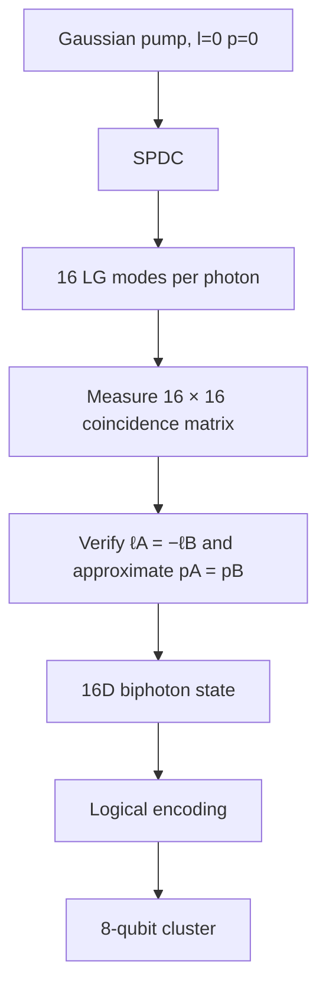

# DiscoBox

An open-source photonic quantum computing platform targeting an **8-qubit** cluster state (and beyond!)

$\small\text{Status: design phase, not yet built.}$

## The quick of it  
The architecture can be described as:

$$
\boxed{
\text{4 OAM DOF}\times\text{4 radial DOF}
\rightarrow
16\text{ orthogonal modes}
\rightarrow
16\text{-dimensional Hilbert space}
\rightarrow
4\text{ logical qubits}
}
$$

We start with a pure 405nm transverse pump wave where $\ell,p=0$.

Then send it into our Beta Barium Borate (BBO) non-linear crystal where our 405-nm pump drives type-II SPDC in BBO, producing correlated 810-nm photon pairs.

Our entangled photons exit the crystal with orthogonal polarizations (from the type-II phase matching), which we exploit with a polarizing beam splitter (PBS) which splits the photons down seperate paths (and some index flipping tricks we will see later).

Each path gets a Multi-plane light converter (MPLC) setup, which is a Spatial Light Modulator (SLM) and a mirror angled to make several passes through it. Here is where our quantum gates get written (via Unitary transformations), and also set the measurement basis before we send it into the fiber. A single-mode fiber only efficiently couples the fundamental Gaussian mode, so the last hologram is calculated to "flatten" whichever mode we're currently projecting onto back down into that fundamental mode.

And finally, each path hits its own Single Photon Avalanche Diode (SPAD) detector. Our final 1-16 value per photon is determined by which of the 16 sequential hologram settings on that path's MPLC was active when the click registered, since our SPAD only registers a click - we're going the cheap route to start with we can upgrade this later.

  

None of this is original work I'm combining Forbes/He/Shen's dimension scaling and Lib/Bromberg's qudit partitioning, with the hopes that we can scale dimensions (and thus effective qubit size) relatively easily by simply swapping in better hardware. 

## Let's make some dimensions


We're scaling our 405nm-laser-spdc-entangled-photons into high dimensions by twisting the orbital angular momentum (2 to the left and 2 to the right for **l=4 distinct values {-2,-1,1,2}**) with our Spatial Light Modulators and altering the radials (**p=4 distinct values {0,1,2,3}**)  for 16 usable dimensions (**l*p**)  in preparation for the next step which must be said with jazz hands: ***hyper-dimensional-spatial-entanglement*** (the creators [Lib & Bromberg](https://www.nature.com/articles/s41566-024-01524-w) call it "high-dimensional spatial encoding of cluster states")

## Hyper Dimensional Spatial Entanglement

Take our 16d Hilbert space we just created and partition it into "registers" where dimension=2 (a traditional qubit) which we connect via tensor products. <u>**This is the part that gives us intra-photon gates without requiring photon on photon interaction.**</u>


Cross photon gates can't be rearranged after SPDC. The graph work is arranging the circuit so anything that needs to interact lands on registers within the same photon where it's free, instead of needing a cross-photon gate.


$\small\textit{Lib and Bromberg have already experimentally encoded four qubits in 16 spatial modes of a photon as part of an eight-qubit cluster state.
}$

Which gives us 4 logical qubits per photon. If you want to build a full GHZ state from registers 1,2&3 via an H and two CNOT gates you can totally do that. Brandt et al. demonstrated exactly this intra-photon gate experimentally, a two-qubit CNOT using the OAM and radial degrees of freedom on a single photon.
Absolutely. I think this section should do more than assert that `16 = 2^4`; it should explain **what the 16-dimensional SPDC state is, how you choose to interpret its basis states as four qubits, and where the actual cluster-state transformation happens**.

I would also make a careful distinction between the **physical state produced by SPDC** and the **logical cluster state you want the MPLCs to produce**. That makes the architecture much harder to misunderstand.

Here is the complete section in paste-ready Markdown:

## From 16D Entanglement to an 8-Qubit Cluster

The key idea behind DiscoBox is that a 16-dimensional spatial Hilbert space can be treated as **four logical qubits**:

$$
16 = 2^4
$$

Our physical basis is the product of four OAM modes and four radial modes:

$$
\ell \in \{-2,-1,+1,+2\},
\qquad
p \in \{0,1,2,3\}
$$

giving 16 orthogonal spatial modes:

$$
|\ell,p\rangle
$$

so that

$$
\mathcal{H}_{16}
=
\mathcal{H}_{\ell,4}\otimes\mathcal{H}_{p,4}
\cong
\mathcal{H}_2^{\otimes4}
$$

The important point is that the photon is not physically carrying four separate particles. It is one photon occupying a 16-dimensional Hilbert space, which we choose to factor into four two-dimensional logical registers.

### Four logical qubits in one photon

We define a mapping from each physical spatial mode to a four-bit computational basis state:

$$
|\ell,p\rangle
\longrightarrow
|q_1q_2q_3q_4\rangle
$$

For example, the exact assignment of the 16 $(\ell,p)$ combinations to the 16 binary strings is a design choice. What matters is that the mapping is one-to-one and remains fixed throughout the experiment.

Conceptually:

$$
\begin{array}{c}
16\ \text{physical spatial modes}
\\[4pt]
\downarrow
\\[4pt]
4\ \text{logical qubits}
\end{array}
$$

This is the same basic resource-efficient idea demonstrated experimentally using high-dimensional spatial modes: multiple logical qubits can reside in the spatial degrees of freedom of a single photon, allowing gates between those logical qubits without requiring two photons to interact.

### Two photons give eight logical qubits

SPDC gives us two photons, so we have two independent 16-dimensional spatial Hilbert spaces:

$$
\mathcal{H}_A\otimes\mathcal{H}_B
=
\mathcal{H}_{16}\otimes\mathcal{H}_{16}
$$

Each photon can therefore encode four logical qubits:

$$
A = (q_1,q_2,q_3,q_4)
$$

$$
B = (q_5,q_6,q_7,q_8)
$$

giving a total logical space of

$$
\mathcal{H}_{16}\otimes\mathcal{H}_{16}
\cong
\mathcal{H}_2^{\otimes8}.
$$

This does **not** mean that SPDC automatically produces an arbitrary eight-qubit state. The physical state generated by the crystal is a high-dimensional biphoton state. We use local optical transformations to convert that physical state into the logical cluster-state representation we want.

### The SPDC state

For an idealized pump with

$$
\ell_{\mathrm{pump}}=0,
$$

OAM conservation gives

$$
\ell_A+\ell_B=0
$$

and therefore

$$
\ell_A=-\ell_B.
$$

The radial index is not an exact conserved quantity in the same way. Instead, the radial correlations depend on the pump profile, crystal, phase matching, collection geometry, and mode overlap. For the purposes of the initial design we approximate the useful correlations as

$$
p_A\approx p_B.
$$

Our idealized 16-dimensional biphoton state can therefore be written as

$$
|\Psi_{\mathrm{SPDC}}\rangle
=
\frac{1}{4}
\sum_{\ell}
\sum_{p}
|\ell,p\rangle_A
|-\ell,p\rangle_B.
$$

This is the **physical high-dimensional entangled state** we are trying to create and characterize.

It is not yet sufficient to simply call this state an eight-qubit cluster state. The logical cluster state appears after we define the qubit encoding and apply the appropriate local transformations.

### Turning the physical basis into a logical basis

We define a unitary mapping on each photon:

$$
U_A:
|\ell,p\rangle_A
\rightarrow
|q_1q_2q_3q_4\rangle_A
$$

and

$$
U_B:
|\ell,p\rangle_B
\rightarrow
|q_5q_6q_7q_8\rangle_B.
$$

The mapping on photon B is chosen deliberately to account for the anti-correlations produced by SPDC. In other words, the physical correlation

$$
|\ell,p\rangle_A
|\!-\ell,p\rangle_B
$$

is mapped onto the desired logical connections between registers on photons A and B.

This is where the choice of binary encoding becomes part of the architecture rather than merely a labeling convention.

### Where the MPLCs come in

The MPLC systems implement programmable spatial-mode transformations on each photon.

We can therefore think of the complete transformation as

$$
|\Psi_{\mathrm{SPDC}}\rangle
\xrightarrow{U_A\otimes U_B}
|\Psi_{\mathrm{logical}}\rangle.
$$

The goal is to choose $U_A$ and $U_B$ such that

$$
|\Psi_{\mathrm{logical}}\rangle
\approx
|C_8\rangle,
$$

where $|C_8\rangle$ is the desired eight-qubit cluster state.

Schematically:

```text
                16D SPDC biphoton
                       │
             ┌─────────┴─────────┐
             │                   │
         Photon A             Photon B
             │                   │
          16 modes             16 modes
             │                   │
           MPLC A              MPLC B
             │                   │
        q1 q2 q3 q4          q5 q6 q7 q8
             └─────────┬─────────┘
                       │
                 8 logical qubits
                       │
                  cluster state
```

The important architectural feature is that the transformations are **local to each photon**. We do not need a deterministic photon-photon interaction to perform arbitrary transformations between the four logical registers encoded within a single photon.

For example, a two-qubit gate between $q_1$ and $q_2$ is implemented as a transformation within the 16-dimensional spatial mode space of photon A:

$$
U_{12}
\subset
U(16)_A.
$$

Likewise, a gate between $q_5$ and $q_6$ acts within the spatial mode space of photon B:

$$
U_{56}
\subset
U(16)_B.
$$

This is the central advantage of the high-dimensional encoding.

### Intra-photon gates

Because the four logical qubits are encoded in one 16-dimensional spatial system, operations between those logical qubits can be implemented as a single higher-dimensional spatial unitary.

For example, a two-qubit CNOT acting on $q_1$ and $q_2$ can be represented as a $16\times16$ unitary:

$$
U_{\mathrm{CNOT}_{1,2}}
=
\mathrm{CNOT}_{1,2}
\otimes
I_{3}
\otimes
I_{4}.
$$

The physical implementation does not require photon $A$ to interact with another photon. The MPLC simply transforms the spatial mode amplitudes according to the required unitary.

This is fundamentally different from trying to implement a two-photon CNOT through direct photon-photon interaction.

### Inter-photon connections

The limitation is that a unitary acting only on photon A cannot directly implement a gate between a logical qubit on A and a logical qubit on B.

For example,

$$
\mathrm{CNOT}_{1,5}
$$

would connect two different photons and cannot be implemented as

$$
U_A\otimes U_B
$$

alone.

The architecture therefore uses the entanglement already supplied by SPDC as the resource connecting the two photons.

The graph is arranged so that the required cluster-state edges are established through the initial biphoton entanglement and the subsequent local transformations, while as much of the computation as possible is performed within each photon's four-qubit register.

This is why the mapping of photon B is important. By reversing the logical ordering on B, we can turn the physical anti-correlations

$$
\ell_A=-\ell_B
$$

into the desired logical pairings between registers.

Conceptually:

```text
Physical SPDC correlations:

A1 ───────────────── B1
A2 ───────────────── B2
A3 ───────────────── B3
A4 ───────────────── B4

             │
             │ logical remapping
             ↓

Desired cluster connections:

q1 ───────────────── q8
q2 ───────────────── q7
q3 ───────────────── q6
q4 ───────────────── q5
```

The exact graph topology and local unitaries will be fixed by the cluster state we choose to implement.

### From the biphoton state to the cluster state

The complete transformation can therefore be summarized as

$$
|\Psi_{\mathrm{SPDC}}\rangle
=
\frac{1}{4}
\sum_{\ell,p}
|\ell,p\rangle_A
|-\ell,p\rangle_B
$$

followed by local spatial transformations:

$$
(U_A\otimes U_B)
|\Psi_{\mathrm{SPDC}}\rangle
\approx
|C_8\rangle.
$$

The important distinction is:

$$
\boxed{
\text{SPDC creates the high-dimensional entanglement}
}
$$

while

$$
\boxed{
\text{MPLC transforms that entanglement into the desired logical representation}
}
$$

and

$$
\boxed{
16=2^4
\quad\Rightarrow\quad
4\text{ logical qubits per photon}.
}
$$

With two photons:

$$
2\times4=8
$$

logical qubits are available.

The resulting state is therefore an **eight-qubit cluster-state resource encoded into the spatial degrees of freedom of two photons**, rather than eight physically separate photons.

### Why this matters

This is the core scaling trick behind DiscoBox.

Adding another independent two-level degree of freedom doubles the available Hilbert-space dimension. More generally,

$$
d = d_\ell d_p
$$

and if

$$
d=2^n,
$$

then the $d$-dimensional spatial state can encode $n$ logical qubits.

For the current design:

$$
d_\ell=4,
\qquad
d_p=4,
$$

so

$$
d=4\times4=16=2^4.
$$

Increasing either dimension therefore increases the number of logical qubits without requiring a corresponding increase in the number of photons.

The practical limitation is no longer simply the number of photons. It becomes the quality of the spatial-mode generation, transformation, sorting, detection, and preservation of coherence as the Hilbert space grows.

That is precisely what the experimental stages of DiscoBox are intended to measure.

## The Math of it

$$
\begin{aligned}
\ell &\in \{-2,-1,+1,+2\} \\
p &\in \{0,1,2,3\}
\end{aligned}
$$

Gives us our physical basis:

$$
|\ell,p\rangle
$$

Start with a clean transverse wave:

$$
|\psi_{\text{pump}}\rangle = |0,0\rangle
$$

Our Type-II BBO crystal gives us perfectly anti-correlated OAM:

$$
\ell_A + \ell_B = \ell_{\text{pump}} = 0 \quad\Rightarrow\quad \ell_A = -\ell_B
$$

The radial is set by the overlap between the pumps profile and the crystal's phase-matching function and approximate is as good as it gets:

$$
p_A \approx p_B \quad (\text{approximate, not conserved})
$$

Making our idealized biphoton correlation:

$$
|\Psi_{\text{ideal}}\rangle =
\frac{1}{4}
\sum_{\ell}
\sum_{p}
|\ell,p\rangle_A
|-\ell,p\rangle_B
$$

We account for noise with a fidelity term:

$$
F = |\langle \Psi_{\text{ideal}} \mid \Psi_{\text{actual}} \rangle|^2
$$

#### photon A
$$
|\ell,p\rangle \rightarrow |q_1 q_2 q_3 q_4\rangle
$$

#### photon B
$$
|\ell,p\rangle \rightarrow |q_8 q_7 q_6 q_5\rangle
$$

We reverse the mapping (defined against $|\Psi_{\text{ideal}}\rangle$) on photon B so that the anti-correlations coming out of the BBO crystal form pairwise connections 1->8, 2->7, 3->6 etc.

Our now 16 dimensional Hilbert space decomposes to:

$$
\begin{aligned}
\mathcal{H}_{16} &= \mathcal{H}_{\ell,4} \otimes \mathcal{H}_{p,4} \\
&\cong (\mathcal{H}_{2} \otimes \mathcal{H}_{2}) \otimes (\mathcal{H}_{2} \otimes \mathcal{H}_{2}) \\
&\cong \mathcal{H}_{2}^{\otimes 4}
\end{aligned}
$$

Which gets us from our OAM(l) and Radial(p) degrees of freedom to our 16d Hilbert space down to our 4 logical qubits per photon.

## The Next Step

We're going to do this in stages:


# Notes
I'm glossing over some real hurdles, a big one being the radial creation and measurement, which the authors below have also flagged. Hoping to do what Valencia et al. did and create a larger mode size but only keep a subsection where the noise is less likely to happen


 Looking at the noise we can see p > 2 has the greatest cross-talk potential so we will widen l before trying p.

 
## References
- Herrera Valencia, N., Srivastav, V., Leedumrongwatthanakun, S., McCutcheon, W. & Malik, M. Entangled ripples and twists of light: Radial and azimuthal Laguerre-Gaussian mode entanglement. *Journal of Optics* 23, 104001 (2021). [https://doi.org/10.1088/2040-8986/ac213c](https://doi.org/10.1088/2040-8986/ac213c)
- Lib, Sulimany & Bromberg, Processing Entangled Photons in High Dimensions with a Programmable Light Converter, *Phys. Rev. Applied* 18, 014063 (2022). [https://arxiv.org/abs/2108.02258](https://arxiv.org/abs/2108.02258)
- Brandt et al., High-dimensional quantum gates using full-field spatial modes of photons *Optica* 2020. [https://arxiv.org/abs/1907.13002](https://arxiv.org/abs/1907.13002)
- He, C., Shen, Y. & Forbes, A. Towards higher-dimensional structured light. *Light Sci. Appl.* 11, 205 (2022). [https://doi.org/10.1038/s41377-022-00897-3](https://doi.org/10.1038/s41377-022-00897-3)
- Lib, O. & Bromberg, Y. Resource-efficient photonic quantum computation with high-dimensional cluster states. *Nature Photonics* 18, 1218–1224 (2024). [https://www.nature.com/articles/s41566-024-01524-w](https://www.nature.com/articles/s41566-024-01524-w)
