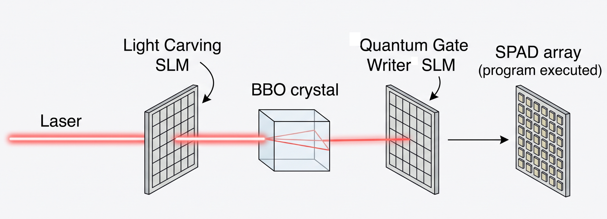
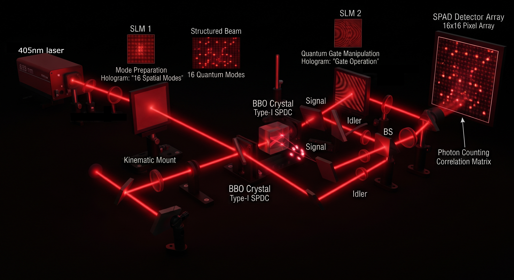

# DiscoBox

A photonic quantum computer you can build at home, achieving cluster states equivalent to __8 qubits__ (and beyond!)

## The quick of it  

We aim our 405nm laser into our Spatial Light Modulator (a hologram) to physically carve the light into 16 unique modes we will use as dimensions (the OAM twist and the radials pictured below).

It continues into our Beta Barium Borate(BBO) non-linear crystal to get our entanglement (1 in 1 billion via Spontaneous Parametric Down Conversion).

It continues into the second Spatial Light Modulator (SLM) where we bake the quantum gates directly into the phase (our "program" gets written here and "executed" at the detector). 

Finally it hits our SPAD detector array, where we register our final output value (1-16) as a coincidence click. (our final output is a number 1-16)

## Lets make some dimensions

We're scaling our 405nm-laser-spdc-entagled-photons into high dimensions by twisting the orbital angular momentum (2 to the left and 2 to the right for **l=4** total) with our Spatial Light Modulators and altering the radials (**p=4**)  for 16 usable dimensions (**l*p**)  in preparation for the next step, **hyper-dimensional-entaglement** ( I'm calling it that - the creators [Lib & Bromberg](https://www.nature.com/articles/s41566-024-01524-w) called it "high-dimensional spatial encoding of cluster states")

## Hyper Dimensional Entaglement

Take our 16d Hilbert space we just created and partition it into "registers" where dimension=2 (a traditional qubit) which we connect via **tensor products** , which is what gives our free gates (free on the same photon).

Cross photon gates get tricky, which also requires a bit of graph work upfront to split the circuit across photons so that interactions can occur for free.

## The Full Picture

## References

- He, C., Shen, Y. & Forbes, A. Towards higher-dimensional structured light. *Light Sci. Appl.* 11, 205 (2022). https://doi.org/10.1038/s41377-022-00897-3
- Lib, O. & Bromberg, Y. Resource-efficient photonic quantum computation with high-dimensional cluster states. *Nature Photonics* 18, 1218–1224 (2024). https://doi.org/10.1038/s41566-024-01524-w
