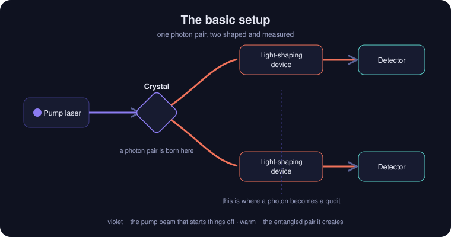
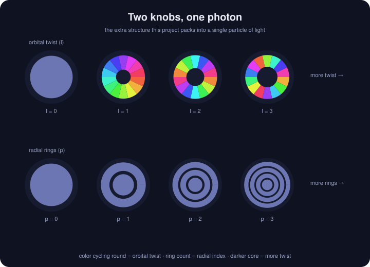

# DiscoBox

A 9 qubit quantum computer you can build at home.

## What this is

This is a build for a photonic quantum computer , using particles of light (photons) shaped in unusually complex ways. It's a personal project, not affiliated with a university or company 

## The core idea, without the jargon

Most quantum computers you've read about are built from "qubits" ;  the quantum version of a bit, which can be 0, 1, or a strange mix of both at once. This project takes a different approach: instead of one qubit per particle of light, it packs *several* qubits' worth of information into a single photon, using extra "knobs" that light naturally has ;  the way it twists as it travels, and the shape of its intensity pattern.

Think of the difference between a coin (two sides) and a many-sided die ;  a single die-roll carries more information than a single coin-flip. The light-based version of that idea is called a "qudit" instead of a "qubit."

Why bother? Because the hardest part of building a quantum computer out of light is getting separate photons to reliably interact with each other ;  it's slow and failure-prone. Pack more computing power into *each* photon, and you need fewer photons to interact overall, which means fewer chances to fail. That trade ;  fewer, richer particles instead of many simple ones ;  is the bet this whole project is built on.

## The recent research that makes it possible

None of the core physics here is new or original to this project. It's an attempt to combine and personally rebuild pieces of real, published research:

- A South African research group (led by physicist Andrew Forbes) has spent years developing the tools to shape light into these complex, high-dimensional states.
- Separately, theoretical physicists worked out how to get extra logic-gate operations "for free" by packing multiple qubits into one of these richer particles ;  turning what would normally need two particles interacting into something one particle can do alone.
- That idea became a real, working laboratory demonstration in 2026.
- A research group in Israel has already built something at meaningfully larger scale using a closely related idea ;  real multi-particle entangled states, generated at a genuinely useful rate.

Worth being upfront about: professional, funded labs have already built more advanced versions of pieces of this. That's fine, and it isn't really the point. The goal here isn't to be first or to outdo people with a real optics lab and a research budget ;  it's to build a working piece of this by hand, from parts, and understand every step of it. Nobody builds a backyard telescope and gives up because professional observatories already exist.

## What's next

1. Get the first two-photon gate working and verified.
2. Combine a handful of those gates into a genuinely connected quantum resource (a "cluster state").
3. Use that resource to run an actual small computation.
4. Scale up from there ;  including honestly reassessing, at each step, whether the current approach still makes sense or needs to change.

## Further reading

The real technical foundations this project builds on and combines:

- Forbes, Nothlawala & Vallés, *"Progress in quantum structured light,"* Nature Photonics (2025) ;  a survey of how far the toolkit for shaping light like this has come.
- Gao, Appel, Friis, Ringbauer & Huber, *"On the role of entanglement in qudit-based circuit compression,"* Quantum (2023) ;  the theory behind packing multiple qubits into one particle.
- Apurav & Singh, *"Efficient circuit compression by multi-qudit entangling gates,"* Physical Review A (2026) ;  extending that theory to more realistic cases.
- Liu et al., *"Heralded high-dimensional photon-photon quantum gate,"* Nature Photonics (2026) ;  the first working version of the core gate this project is trying to replicate.
- Lib & Bromberg, *"Resource-efficient photonic quantum computation with high-dimensional cluster states,"* Nature Photonics (2024) ;  the closest existing precedent to the eventual goal.

---
# Up Next: [The Build](BUILD.md)

## And for the initiated

#### The architecture, stated plainly

One photon carries a qudit in the joint (OAM, radial) Laguerre-Gauss mode space ;  dimension d = (l_max+1)(p_max+1). Bundle g = (log₂ d) logical qubits per physical qudit (Gao/Huber compression). Gates entirely inside one bundle are free, local, near-unit-fidelity single-qudit operations. Gates that cross bundles use the Apurav/Singh multi-level CZ, built from Selective Mode Routers, at ~1/8 postselected success. Wire enough of these together and you have a cluster state; adaptive measurements on it, read through the tessarine/geometric-algebra (Cl(4,0)) formalism already chosen, run the Raussendorf–Briegel one-way computation.

