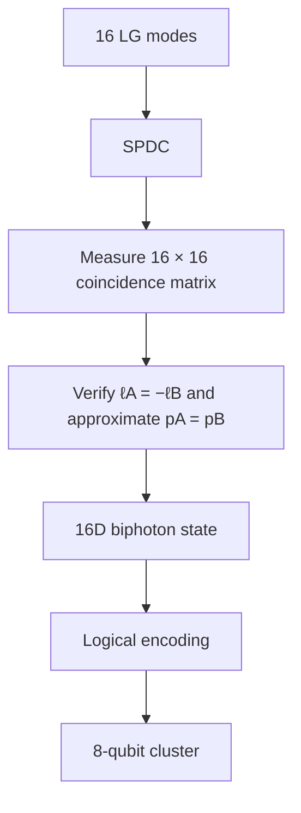

# DiscoBox

A photonic quantum computer you can build at home, targeting cluster states equivalent to __8 qubits__ (and beyond!)
Status: design phase, not yet built.

## The quick of it  
The architecture can be described as:

$$
\boxed{
\text{OAM DOF}\times\text{radial DOF}
\rightarrow
16\text{ orthogonal LG modes}
\rightarrow
16\text{-dimensional Hilbert space}
\rightarrow
4\text{ logical qubits}
}
$$

We aim our 405nm laser into our Spatial Light Modulator (a hologram) to prepare a coherent superposition of 16 selected Laguerre-Gaussian (LG) spatial modes (the OAM twists and the radials pictured in the next section).

It continues into our Beta Barium Borate (BBO) non-linear crystal where occasionally one 405nm photon splits into two 810nm daughter photons and become entangled via Spontaneous Parametric Down Conversion (SPDC). Seeding the crystal with a pump beam that's already in superposition across our 16 modes (**l&p**--see next section) gives us our full 16-dimensional state space per photon.

It continues into the second Spatial Light Modulator (SLM) where it forms a programmable multi-plane light converter (MPLC), where we write the gates as high-dimensional spatial transformations. (our "program" gets written here and "executed" at the detector). 

Finally it hits our Single Photon Avalanche Diode (SPAD) detector array, where we register our final output (an agreeing pair of numbers between 1-16, one per entangled photon, actually a mapping since the bbo gives us anti-correlation but the agreeing part is what's important).

  

*Note: We probably need a mode sorter before the final SPAD array to translate $\[
|\ell,p\rangle \longrightarrow |x_i,y_i\rangle
\] $ 

None of this is original work I'm combining Forbes/He/Shen's dimension scaling and Lib/Bromberg's qudit partitioning, with the hopes that we can scale dimensions and thus effective qubit size relatively easily by swapping in better hardware. 

## Let's make us some dimensions

We're scaling our 405nm-laser-spdc-entangled-photons into high dimensions by twisting the orbital angular momentum (2 to the left and 2 to the right for **l=4 distinct values {-2,-1,1,2}**) with our Spatial Light Modulators and altering the radials (**p=4 distinct values {0,1,2,3}**)  for 16 usable dimensions (**l*p**)  in preparation for the next step, which I normally say with jazz hands: ***hyper-dimensional-spatial-entanglement*** (the creators [Lib & Bromberg](https://www.nature.com/articles/s41566-024-01524-w) call it "high-dimensional spatial encoding of cluster states")

## Hyper Dimensional Spatial Entanglement

Take our 16d Hilbert space we just created and partition it into "registers" where dimension=2 (a traditional qubit) which we connect via **tensor products**. This is the part that gives us deterministic intra-photon gates without requiring photon on photon interaction.

Cross photon gates can't be rearranged after SPDC. The graph work is arranging the circuit so anything that needs to interact lands on registers within the same photon where it's free, instead of needing a cross-photon gate.

A 16-dimensional  Hilbert space can be encoded as four logical qubits because \(16=2^4\). Lib & Bromberg experimentally encode four qubits in 16 spatial modes of a photon as part of an eight-qubit cluster state.

Which gives us 4 usable qubits per photon. If you want to build a full GHZ state from registers 1,2&3 via a H and two CNOT's you can totally do that. 

## The Math of it

$$
\begin{aligned}
\ell &\in \{-2,-1,+1,+2\} \\
p &\in \{0,1,2,3\}
\end{aligned}
$$

gives us our physical basis

$$
\begin{aligned}
|\ell,p\rangle
\end{aligned}
$$

for 16 orthogonal Laguerre-Gaussian (LG) modes. Now we prime our pump

$$
|\psi_{\text{pump}}\rangle = \sum_{\ell,p} c_{\ell,p} |\ell,p\rangle
$$

And put it through the crystal to get our idealized biphoton correlation:

$$
\[
|\Psi\rangle =
\frac{1}{4}
\sum_{\ell}
\sum_{p}
|\ell,p\rangle_A
|-\ell,p\rangle_B
\]
$$

#### photon A
$$
|\ell,p\rangle \rightarrow |q_1 q_2 q_3 q_4\rangle
$$

#### photon B
$$
|\ell,p\rangle \rightarrow |q_8 q_7 q_6 q_5\rangle
$$

We reverse the mapping on photon B so that the anti-correlations coming out of the BBO crystal form pairwise connections 1->8, 2->7, 3->6 etc.

which our now 16 dimensional Hilbert space decomposes to 

$$
\begin{aligned}
\mathcal{H}_{16} &= \mathcal{H}_{\ell,4} \otimes \mathcal{H}_{p,4} \\
&\cong (\mathcal{H}_{2} \otimes \mathcal{H}_{2}) \otimes (\mathcal{H}_{2} \otimes \mathcal{H}_{2}) \\
&\cong \mathcal{H}_{2}^{\otimes 4}
\end{aligned}
$$

Which gets us from our OAM(l) and Radial(p) degrees of freedom to our 16d Hilbert space down to our 4, 2d logical qubits.

## The Next Step

We're going to do this in stages:

Then finally, confirm the Bell experiments. You can't trust it unless you replicate it yourself.

 
## References
- Herrera Valencia, N., Srivastav, V., Leedumrongwatthanakun, S., McCutcheon, W. & Malik, M. Entangled ripples and twists of light: Radial and azimuthal Laguerre-Gaussian mode entanglement. *Journal of Optics* 23, 104001 (2021). [https://doi.org/10.1088/2040-8986/ac213c](https://doi.org/10.1088/2040-8986/ac213c)
- Lib & Bromberg, Resource-efficient photonic quantum computation with high-dimensional cluster states, *Nature Photonics* 2024 [https://www.researchgate.net/publication/384072569_Resource-efficient_photonic_quantum_computation_with_high-dimensional_cluster_states](https://www.researchgate.net/publication/384072569_Resource-efficient_photonic_quantum_computation_with_high-dimensional_cluster_states)
- Lib, Sulimany & Bromberg, Processing Entangled Photons in High Dimensions with a Programmable Light Converter, *Phys. Rev. Applied* 2022. [https://arxiv.org/abs/2108.02258](https://arxiv.org/abs/2108.02258)
- Brandt et al., High-dimensional quantum gates using full-field spatial modes of photons *Optica* 2020. [https://arxiv.org/abs/1907.13002](https://arxiv.org/abs/1907.13002)
- He, C., Shen, Y. & Forbes, A. Towards higher-dimensional structured light. *Light Sci. Appl.* 11, 205 (2022). [https://doi.org/10.1038/s41377-022-00897-3](https://doi.org/10.1038/s41377-022-00897-3)
- Lib, O. & Bromberg, Y. Resource-efficient photonic quantum computation with high-dimensional cluster states. *Nature Photonics* 18, 1218–1224 (2024). [https://www.nature.com/articles/s41566-024-01524-w](https://www.nature.com/articles/s41566-024-01524-w)
