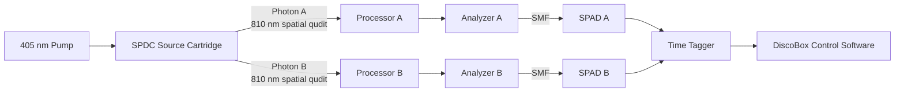
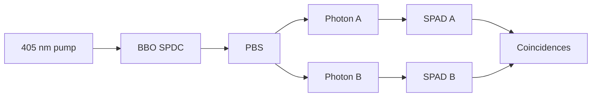

# DiscoBox

An open-source photonic quantum computing platform targeting a **4-qubit linear cluster state** using only two photons.

$\small\text{Status: design phase, not yet built.}$

## The quick of it

We're going to start smaller.

Instead of trying to immediately use both OAM and radial modes to cram four logical qubits into each photon, we're freezing the radial degree of freedom at:

$$p=0$$

and using four orbital angular momentum modes:

$$\ell\in\{-2,-1,+1,+2\}.$$

That gives us a four-dimensional spatial Hilbert space per photon:

$$4\text{ OAM modes}\rightarrow4\text{-dimensional qudit}\rightarrow2\text{ logical qubits}.$$

We create two entangled photons, so:

$$\boxed{2\text{ photons}\times2\text{ logical qubits/photon}=4\text{ logical qubits}}$$

The entire first DiscoBox is built around proving that architecture end to end.

No radial qubits yet.

No giant detector array yet.

No attempt at scaling to eight or ten qubits yet.

First we're going to make the smallest version of this thing that actually works.

---

## What the machine physically looks like

DiscoBox is split into optical cartridges:



The important bit is that **the connections between the source, processors and analyzers are not ordinary single-mode fiber**.

Our transverse mode is the quantum state.

If we shove

$$\sum_{\ell}c_\ell|\ell\rangle$$

into an ordinary single-mode fiber, the fiber only accepts its fundamental Gaussian mode and we've thrown away the thing we're trying to compute with.

So while the photon still contains an OAM qudit, it travels between cartridges through a short enclosed free-space optical connection.

Only after the analyzer converts the selected mode back into a Gaussian do we use ordinary fiber.

The machine is therefore roughly:

$$\boxed{\text{free-space spatial qudit}\rightarrow\text{processing}\rightarrow\text{measurement projection}\rightarrow\text{Gaussian}\rightarrow\text{fiber}\rightarrow\text{SPAD}}$$

---

# Cartridge 1 — The Source

We start with a clean 405 nm Gaussian pump:

$$|\psi_{\text{pump}}\rangle=|0,0\rangle.$$

It goes into our Beta Barium Borate (BBO) nonlinear crystal where Type-II spontaneous parametric down-conversion occasionally converts one pump photon into two approximately 810 nm daughter photons.

The daughters leave with orthogonal polarizations, which gives us a convenient way to separate them into two paths:

```text
                    405 nm
                      │
                      ▼
                 ┌─────────┐
                 │   BBO   │
                 └────┬────┘
                      │
                     SPDC
                      │
                      ▼
                     PBS
                   /     \
                  /       \
            Photon A     Photon B
              810nm        810nm
```

Those become the two physical photonic rails of DiscoBox.

We remove the remaining pump light, spectrally clean up the 810 nm photons, collimate both outputs and send them through the two output ports of the source cartridge.

The SPDC source gives us OAM anti-correlation:

$$\ell_A+\ell_B=\ell_{\text{pump}}=0$$

so:

$$\ell_A=-\ell_B.$$

We're going to select four modes:

$$\ell\in\{-2,-1,+1,+2\}$$

and only accept the lowest radial mode:

$$p=0.$$

So our idealized four-dimensional entangled state is:

$$|\Phi_4\rangle=\frac{1}{2}\sum_{\ell\in\{-2,-1,+1,+2\}}|\ell,0\rangle_A|-\ell,0\rangle_B.$$

Real life will instead give us something closer to:

$$|\Psi\rangle=\sum_\ell c_\ell|\ell,0\rangle_A|-\ell,0\rangle_B+|\text{junk}\rangle$$

where the amplitudes aren't perfectly equal and the junk contains radial leakage, neighboring OAM modes, background counts and all the other fun things reality provides.

Characterizing that is literally Stage 1 of the project.

---

# The DiscoBox Optical Port

Every cartridge that carries the spatial qudit gets the same mechanical and optical interface.

The interface is a **collimated 810 nm free-space beam** passing through a keyed mechanical port.

```text
       CARTRIDGE A                         CARTRIDGE B

 ┌─────────────────────┐             ┌─────────────────────┐
 │                     │             │                     │
 │     internal        │             │       internal      │
 │      optics         │             │        optics       │
 │         │           │             │           │         │
 │         ●───────────┼═════════════┼───────────●         │
 │                     │ optical     │                     │
 └─────────────────────┘ tunnel      └─────────────────────┘
```

The section marked `══════` is not fiber.

It's a short opaque optical tube.

The cartridges bolt to a common chassis and locate against mechanical reference surfaces/dowel pins so removing a cartridge does not mean completely realigning the machine.

The optical interface specification eventually defines:

- wavelength: approximately 810 nm
- polarization
- beam axis height
- nominal beam diameter/waist
- wavefront reference plane
- aperture size
- mechanical bolt pattern
- mechanical datum surfaces
- allowed angular displacement
- allowed lateral displacement

I'm deliberately not picking the final beam diameter yet.

That gets measured and chosen while we build the source because it needs to match the SLM aperture, diffraction behavior and OAM mode size.

Once chosen, it becomes part of the DiscoBox hardware specification.

The goal is that a processor shouldn't care what source generated the photon.

It receives:

$$|\psi\rangle=\sum_\ell c_\ell|\ell,p=0\rangle$$

at a known optical plane and does its job.

---

# Cartridges 2 & 3 — The Processors

Photon A and photon B each get an identical processor cartridge.

```text
                 PROCESSOR

     qudit in
        │
        ▼
   beam conditioning
        │
        ▼
   ┌───────────┐
   │           │
   │ SLM/MPLC  │
   │           │
   └─────┬─────┘
         │
         ▼
      qudit out
```

For the development version, the heart of the processor is a programmable multi-plane light converter.

The basic idea is an SLM plus relay/mirror geometry which allows the spatial field to encounter multiple independently calculated phase planes.

Instead of physically wiring four optical paths together, we perform a transformation directly in the four-dimensional spatial mode space:

$$|\psi_{\text{out}}\rangle=U|\psi_{\text{in}}\rangle.$$

For the first machine:

$$U\in U(4).$$

That is enough space for two logical qubits.

For DiscoBox the SLM is our development engine.

We can change the transformation in software instead of rebuilding the optics every time we get something wrong.

Eventually transformations which never need to change could be replaced with fixed phase elements or fabricated MPLC optics.

But absolutely not yet.

First we make it work.

---

# Let's make some qubits

Each photon has four physical basis states:

$$|-2,0\rangle,\quad|-1,0\rangle,\quad|+1,0\rangle,\quad|+2,0\rangle.$$

A four-dimensional Hilbert space can be partitioned into two logical two-dimensional registers:

$$\mathcal H_4\cong\mathcal H_2\otimes\mathcal H_2.$$

So photon A becomes:

$$|\ell,0\rangle_A\rightarrow|q_1q_2\rangle.$$

We define:

$$|-2,0\rangle_A\rightarrow|00\rangle_{12}$$

$$|-1,0\rangle_A\rightarrow|01\rangle_{12}$$

$$|+1,0\rangle_A\rightarrow|10\rangle_{12}$$

$$|+2,0\rangle_A\rightarrow|11\rangle_{12}$$

Photon B gets the anti-correlated mapping:

$$|\ell,0\rangle_B\rightarrow|q_4q_3\rangle.$$

Specifically:

$$|+2,0\rangle_B\rightarrow|00\rangle_{43}$$

$$|+1,0\rangle_B\rightarrow|01\rangle_{43}$$

$$|-1,0\rangle_B\rightarrow|10\rangle_{43}$$

$$|-2,0\rangle_B\rightarrow|11\rangle_{43}$$

That index reversal is intentional.

Because SPDC gives:

$$\ell_B=-\ell_A,$$

the same logical bit string appears on both photons.

Our ideal ququart pair can therefore be written:

$$|\Phi_4\rangle=\frac{1}{2}\sum_{q_1,q_2}|q_1q_2\rangle_A|q_1q_2\rangle_B.$$

With photon B labelled as \(q_4q_3\), this decomposes to:

$$|\Phi_4\rangle=|\Phi^+\rangle_{1,4}\otimes|\Phi^+\rangle_{2,3}.$$

So the SPDC source has effectively given us two logical entangled pairs using only **two physical photons**.

That's the trick we're building the machine around.

---

# Turning two Bell pairs into a 4-qubit cluster

Right after the source our graph looks roughly like:

```text
q4 ─── q1

q3 ─── q2
```

Two disconnected entangled pairs.

But \(q_1\) and \(q_2\) are not two physical photons.

They're two partitions of the **same four-dimensional photon**.

That means we can perform a gate between them by transforming the four spatial modes of photon A.

Apply:

$$CZ_{1,2}$$

inside Processor A.

In the logical basis:

$$|00\rangle,\quad|01\rangle,\quad|10\rangle,\quad|11\rangle$$

the CZ is simply:

$$CZ=\begin{pmatrix}1&0&0&0\\0&1&0&0\\0&0&1&0\\0&0&0&-1\end{pmatrix}.$$

In other words:

> everything passes unchanged except the physical mode corresponding to \(q_1=q_2=1\), which receives a \(\pi\) phase shift.

Now our graph becomes:

```text
q4 ─── q1 ─── q2 ─── q3
```

which is a four-node linear cluster state.

So the entire four-qubit state requires:

- two physical photons
- one four-dimensional qudit per photon
- the original cross-photon entanglement from SPDC
- one intra-photon logical CZ gate

and no photon-on-photon gate after the SPDC source.

That's the first complete DiscoBox.

---

# Why this is actually useful

Normally a four-qubit photonic system suggests four separate photons.

DiscoBox instead uses:

$$2\text{ photons}\times4\text{ spatial dimensions}$$

and partitions those dimensions into:

$$2\text{ logical qubits/photon}.$$

The expensive part of photonics is often getting many photons to exist, survive and arrive at the right place at the right time.

High-dimensional encoding lets us carry more logical state on each photon.

That is the central idea we're borrowing from Lib and Bromberg's high-dimensional cluster-state architecture.

None of this is original physics.

DiscoBox is an attempt to turn those ideas into an open-source machine that can be built progressively with ordinary laboratory optics.

---

# Cartridges 4 & 5 — The Analyzers

After processing, each photon enters an analyzer cartridge.

Initially we're intentionally going to use the slow version because it's cheap and easy to understand.

```text
      spatial qudit
            │
            ▼
     measurement SLM
            │
            ▼
     mode flattening
            │
            ▼
      coupling lens
            │
            ▼
           SMF
            │
            ▼
          SPAD
```

The measurement hologram asks a question such as:

$$\text{“Are you }|\ell=-1,p=0\rangle\text{?”}$$

If that is the incoming spatial mode, the analyzer transforms it toward the fundamental Gaussian mode:

$$|\ell,p\rangle\rightarrow|0,0\rangle.$$

The single-mode fiber then becomes extremely useful.

Instead of being a problem, its refusal to carry higher spatial modes acts as our spatial filter.

Only light successfully converted into approximately the fundamental Gaussian mode couples efficiently into the fiber.

At this point we have intentionally destroyed the spatial encoding because we're measuring it.

So from here onward:

$$\boxed{\text{ordinary SMF is fine}.}$$

The fiber runs to a single-photon avalanche diode.

We need two SPADs total:

```text
Photon A → Analyzer A → SMF → SPAD A ──┐
                                        ├──► Time Tagger
Photon B → Analyzer B → SMF → SPAD B ──┘
```

---

# The detector doesn't decide what mode it saw

This is important.

The SPAD is dumb.

It says:

> click

That's it.

The analyzer knows what projector was loaded when the click happened.

So the computer records something like:

```text
time = 18429103.421 ns
analyzer_A = |-2,0>
analyzer_B = |+2,0>
SPAD_A = click
SPAD_B = click
```

If the clicks occur inside our coincidence window, that contributes one count to:

$$C_{-2,+2}.$$

Cycle through all four OAM projections on both sides and we build:

$$C=\begin{pmatrix}C_{-2,-2}&C_{-2,-1}&C_{-2,+1}&C_{-2,+2}\\C_{-1,-2}&C_{-1,-1}&C_{-1,+1}&C_{-1,+2}\\C_{+1,-2}&C_{+1,-1}&C_{+1,+1}&C_{+1,+2}\\C_{+2,-2}&C_{+2,-1}&C_{+2,+1}&C_{+2,+2}\end{pmatrix}.$$

That's sixteen projector combinations.

Our ideal computational-basis measurement should light up the anti-diagonal:

$$\ell_A=-\ell_B.$$

Something roughly like:

```text
Photon B
          -2  -1  +1  +2

Photon A

   -2      .   .   .   █
   -1      .   .   █   .
   +1      .   █   .   .
   +2      █   .   .   .
```

Real life gives us fuzz around those peaks.

That fuzz is one of the things we measure.

Also: **this 4×4 coincidence matrix is not full state tomography.**

It's our first sanity check.

Full characterization requires projections into additional superposition bases.

---

# The Time Tagger

Both SPAD outputs terminate at the same timing system.

Every detector pulse becomes a timestamp:

$$t_A,\quad t_B.$$

The software searches for:

$$|t_A-t_B|<\Delta t$$

where \(\Delta t\) is our calibrated coincidence window.

So the detector side of DiscoBox is not:

```text
SPAD A ↔ SPAD B
```

It's:

```text
SPAD A ───────┐
               │
               ▼
           TIME TAGGER ─────► computer
               ▲
               │
SPAD B ───────┘
```

The time tagger is the common clock.

We therefore don't need the two detector modules trying to synchronize themselves independently.

---

# The Electrical Connection Between Cartridges

There are really three different kinds of connections in DiscoBox.

## Quantum optical connection

Between:

- source
- processor
- analyzer

we use the enclosed free-space spatial-mode port.

```text
SOURCE ═════► PROCESSOR ═════► ANALYZER
```

`═════` means spatial-mode-preserving free space.

---

## Fiber connection

Between:

- analyzer
- SPAD

we use ordinary single-mode fiber.

```text
ANALYZER ─fiber─► SPAD
```

because the analyzer has already projected the spatial qudit onto a Gaussian mode.

---

## Electrical connection

Everything plugs into the control computer or timing system:

```text
                    COMPUTER
                  /     |      \
                 /      |       \
          Processor A Processor B Analyzers
              SLM        SLM        SLMs

SPAD A ──TTL────────┐
                    ├── TIME TAGGER ──USB/Ethernet── COMPUTER
SPAD B ──TTL────────┘
```

Eventually I'd like each cartridge to identify itself to the control software and carry its own calibration data.

Something like:

```text
processor-A/
    hardware.yaml
    calibration/
    phase_response.npy
    transforms/
```

Then the physical machine and the software description of the physical machine stay together.

---

# The Mechanical Chassis

The cartridges shouldn't sit independently on random parts of an optical table.

They all bolt to one rigid base.

Something like:

```text
┌────────────────────────────────────────────────────────────┐
│                       DISCOBOX                              │
│                                                            │
│                    ┌──────────┐                            │
│                    │  SOURCE  │                            │
│                    └────┬─┬───┘                            │
│                         │ │                                │
│                 ┌───────┘ └───────┐                        │
│                 ▼                 ▼                        │
│          ┌────────────┐     ┌────────────┐                  │
│          │ PROCESSOR A│     │ PROCESSOR B│                  │
│          └─────┬──────┘     └─────┬──────┘                  │
│                │                  │                         │
│                ▼                  ▼                         │
│          ┌────────────┐     ┌────────────┐                  │
│          │ ANALYZER A │     │ ANALYZER B │                  │
│          └─────┬──────┘     └─────┬──────┘                  │
│                │                  │                         │
└────────────────┼──────────────────┼─────────────────────────┘
                 │ SMF              │ SMF
                 ▼                  ▼
              SPAD A             SPAD B
                  \                /
                   \              /
                    ▼            ▼
                     TIME TAGGER
```

Internally each optical cartridge is enclosed.

The goal is to have:

- short optical paths
- no exposed beams during normal operation
- minimal air movement
- minimal dust
- minimal dependence on room lighting
- rigid optical geometry
- repeatable cartridge placement

For development we'll still use adjustable optics.

Once a geometry works, we make it boring.

Bolt it down.

Put the lid on.

Stop touching it.

---

# The software

The control software has four jobs.

### 1. Generate transformations

It takes a desired logical transformation:

$$U_{\text{logical}}$$

and turns it into the phase planes required by the processor MPLC.

For example:

$$CZ=\mathrm{diag}(1,1,1,-1).$$
---

### 2. Control measurement bases

It loads the correct analyzer holograms for measurements such as:

$$Z,\quad X,\quad Y$$

or arbitrary superpositions of our four physical modes.

---

### 3. Collect coincidences

For every measurement setting it stores:

$$N_A,\quad N_B,\quad N_{AB},\quad t,\quad\Delta t.$$

---

### 4. Calibrate the machine

This might eventually be the most important software in the project.

We want to measure the actual transformation:

$$M_{\text{measured}}$$

rather than assuming the optics did what we asked.

The software can measure things like:

- mode crosstalk
- coupling efficiency
- detector dark counts
- accidental coincidences
- mode-dependent loss
- processor transfer matrix
- phase calibration
- gate fidelity

The machine should know how badly it's behaving.

---

# How we're actually going to build this

We're not building the complete machine and turning it on for the first time.

That sounds like an excellent way to spend a lot of money learning absolutely nothing.

We're doing it in stages.

## Stage 0 — Make photons



Goal:

**prove the source works.**

We want stable 810 nm photon-pair coincidences before OAM enters the conversation.

---

# Stage 1 — OAM correlation

Add the analyzers.

Keep:

$$p=0.$$

Measure:

$$\ell\in\{-2,-1,+1,+2\}.$$

Build the full:

$$4\times4$$

coincidence matrix.

Goal:

$$\ell_A=-\ell_B.$$

If this doesn't work, stop here and fix it.

There is no reason to build a quantum gate on top of a state we can't cleanly measure.

---

# Stage 2 — Four-dimensional entanglement

Now verify that we don't merely have classical OAM correlation.

Measure superposition bases and characterize the coherence between the four selected modes.

Our target state is approximately:

$$|\Phi_4\rangle=\frac{1}{2}\left(|-2\rangle_A|+2\rangle_B+|-1\rangle_A|+1\rangle_B+|+1\rangle_A|-1\rangle_B+|+2\rangle_A|-2\rangle_B\right)$$

with \(p=0\) implied everywhere.

Goal:

**demonstrate a useful four-dimensional biphoton state.**

At this point DiscoBox is already a legitimate high-dimensional quantum-optics experiment.

---

# Stage 3 — Build one processor

Do not build both processors yet.

Put Processor A between the source and Analyzer A.

First ask it to implement:

$$I.$$

If inserting the processor destroys the state, we fix that before doing anything clever.

Then test permutations.

Then phases.

Then superpositions.

Measure the physical transfer matrix:

$$M_{ij}=\langle i|U|j\rangle.$$

Eventually ask it to implement:

$$CZ=\mathrm{diag}(1,1,1,-1).$$

Goal:

**demonstrate a programmable two-logical-qubit operation on one four-dimensional photon.**

---

# Stage 4 — Build the mirror processor

Once Processor A works, duplicate it.

Processor B should be mechanically and electrically identical.

This gives:

```text
SOURCE

 ├── Photon A → PROCESSOR A → ANALYZER A → SPAD A
 │
 └── Photon B → PROCESSOR B → ANALYZER B → SPAD B
```

Even though the first cluster-state experiment may not require Processor B to perform a complicated gate, symmetry makes the platform much easier to expand and characterize.

---

# Stage 5 — Make the four-qubit cluster

Prepare our four-dimensional entangled state:

$$|\Phi_4\rangle.$$

Interpret it as:

$$|\Phi^+\rangle_{1,4}\otimes|\Phi^+\rangle_{2,3}.$$

Then apply:

$$CZ_{1,2}$$

inside Photon A.

Target graph:

```text
q4 ─── q1 ─── q2 ─── q3
```

Relabel the nodes however we like and it's simply a four-node linear cluster:

```text
q1 ─── q2 ─── q3 ─── q4
```

Goal:

$$\boxed{\text{4 logical qubits carried by 2 physical photons}}$$

and experimentally verify the cluster correlations.

That's DiscoBox v1.

---

# What we're explicitly NOT doing yet

No:

$$p=1,2,3.$$

No:

$$16D.$$

No eight-qubit claim.

No giant SPAD camera.

No fabricated MPLC.

No magic fiber that perfectly carries every OAM mode.

No pretending an SLM and a BBO crystal automatically constitute a quantum computer.

We're building:

$$\boxed{4\text{ OAM modes}\times2\text{ photons}\rightarrow2\text{ logical qubits/photon}\rightarrow4\text{-qubit cluster}}$$

and we're going to characterize every layer before adding another one.

---

# Where this can go later

The architecture deliberately leaves the door open.

Once the four-dimensional version works we can ask whether the easiest next scaling direction is:

$$8\text{ OAM modes}\times p=0$$

or:

$$4\text{ OAM modes}\times\{p=0,1\}.$$

But that is a future DiscoBox's problem.

The first one only needs to prove that the underlying idea works.

---

# References

- Lib, O. & Bromberg, Y. *Resource-efficient photonic quantum computation with high-dimensional cluster states.* Nature Photonics **18**, 1218–1224 (2024). DOI: 10.1038/s41566-024-01524-w.
- Lib, O., Sulimany, K. & Bromberg, Y. *Processing Entangled Photons in High Dimensions with a Programmable Light Converter.* Physical Review Applied **18**, 014063 (2022). DOI: 10.1103/PhysRevApplied.18.014063.
- Brandt, F., Hiekkamäki, M., Bouchard, F., Huber, M. & Fickler, R. *High-dimensional quantum gates using full-field spatial modes of photons.* Optica **7**, 98–107 (2020). DOI: 10.1364/OPTICA.375875.
